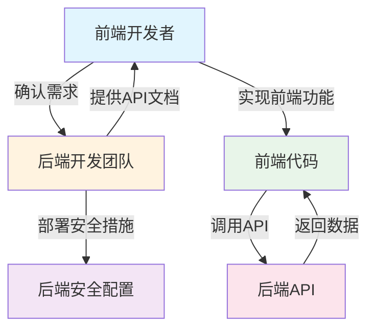

# 项目安全与质量检查报告

**检查日期**: 2026-01-07  
**项目名称**: zibuyu_blog  
**检查范围**: 安全漏洞、代码质量、性能优化、用户体验  
**技术栈**: Vue 3 + Vite + Element Plus + Pinia + Axios

---

## 📊 问题统计总览

| 严重程度 | 数量 | 占比 |
|---------|------|------|
| 🔴 严重 | 4 | 30.8% |
| 🟠 高危 | 3 | 23.1% |
| 🟡 中等 | 3 | 23.1% |
| 🟢 低优先级 | 3 | 23.1% |
| **总计** | **13** | **100%** |

---

## � 架构说明与职责划分

**项目架构**: 前后端分离模式  
**当前文档范围**: 前端部分（Vue 3 + Vite + Element Plus + Pinia + Axios）  
**后端协作**: 需要与后端API配合实现完整安全方案

### 前端职责范围（前端开发者可控）

| 安全领域 | 前端可完成的措施 | 依赖后端 |
|---------|-----------------|---------|
| 敏感信息管理 | ✅ 使用环境变量替代硬编码 | ❌ 不依赖 |
| XSS防护 | ✅ 输入验证、输出编码、DOMPurify净化 | ❌ 不依赖 |
| 密码强度验证 | ✅ 前端密码强度检查 | ❌ 不依赖 |
| HTTPS使用 | ✅ 强制使用HTTPS地址 | ❌ 不依赖 |
| 请求拦截 | ✅ Axios请求/响应拦截器 | 部分依赖 |
| CSRF防护 | ✅ 自动附加token到请求头 | ✅ 需要后端提供token接口 |
| 加密传输 | ✅ 客户端加密（如需要） | ✅ 需要后端配合解密 |

### 后端职责范围（需要与后端团队协调）

| 安全领域 | 后端必须实现 | 前端需要确认 |
|---------|-------------|-------------|
| HTTPS | 部署SSL证书，强制HTTPS跳转 | ✅ 确认已部署 |
| 密码哈希 | 使用bcrypt/argon2等安全哈希算法 | ✅ 确认算法 |
| CSRF保护 | 生成/验证token，设置安全Cookie | ✅ 确认接口 |
| 敏感信息存储 | 密钥安全存储，不返回敏感数据 | ✅ 确认存储方式 |
| API安全 | 频率限制、参数验证、注入防护 | ✅ 确认实现 |
| 会话管理 | 安全Session/Cookie配置 | ✅ 确认配置 |

### 安全修复优先级（前后端分离模式）

#### 第一优先级：前端可独立完成 ✅

1. **敏感信息管理** - 使用环境变量，不依赖后端
2. **XSS防护** - 前端净化，不依赖后端
3. **密码强度验证** - 前端校验，不依赖后端

#### 第二优先级：需要后端简单配合 ✅

4. **HTTPS使用** - 后端部署SSL，前端只需使用HTTPS地址

#### 第三优先级：需要后端深度配合 ⚠️

5. **CSRF防护** - 需要后端提供token生成/验证接口
6. **加密传输** - 需要后端配合加解密逻辑

### 前后端协作流程



### 本文档使用说明

- ✅ **前端可执行**: 标注"前端实现"的代码可直接在当前项目中实施
- ⚠️ **需要协调后端**: 标注"需要后端配合"的内容需要与后端团队沟通
- ❌ **后端实现**: 标注"后端职责"的内容由后端团队负责，前端仅需确认

---

## �🔴 严重问题 (Critical)

### 问题 1: 硬编码的敏感信息泄露风险

**严重程度**: 🔴 严重  
**影响范围**: 全局安全

#### 涉及文件路径

```
d:\06_program_code\zibuyu_blog\vite.config.js
d:\06_program_code\zibuyu_blog\src\server\serverRequest.js
d:\06_program_code\zibuyu_blog\src\server\defaultChat.js
d:\06_program_code\zibuyu_blog\src\stores\aiEnglish_demo.js
```

#### 具体位置

1. **vite.config.js:48** - 代理目标地址
   ```javascript
   target: 'http://8.138.106.241/api',
   ```

2. **vite.config.js:60** - 服务器URL定义
   ```javascript
   'SERVER_URL':JSON.stringify('http://8.138.106.241/')
   ```

3. **serverRequest.js:14** - 硬编码的Authorization头
   ```javascript
   'Authorization': 'Bearer your_token_here',
   ```

4. **defaultChat.js:17** - 硬编码的Authorization头
   ```javascript
   'Authorization': 'Bearer your_token_here',
   ```

5. **aiEnglish_demo.js:232** - 硬编码的token
   ```javascript
   return "Bearer xxxxxxx"
   ```

#### 问题描述

- 生产环境服务器地址 `http://8.138.106.241` 硬编码在前端代码中
- API密钥使用占位符 `your_token_here` 和 `xxxxxxx`，可能包含真实密钥
- 使用HTTP而非HTTPS协议传输数据
- 任何人都可以通过查看源代码获取这些敏感信息

#### 风险评估

- **风险等级**: 极高
- **潜在影响**: 
  - 服务器被攻击
  - API密钥被盗用
  - 数据泄露
  - 中间人攻击

#### 修复方案

**步骤 1: 创建环境变量文件**

```bash
# 创建 .env 文件（开发环境）
VITE_SERVER_URL=http://localhost:8000/

# 创建 .env.production 文件（生产环境）
VITE_SERVER_URL=https://your-domain.com/
VITE_API_BASE_URL=https://api.your-domain.com/
```

**步骤 2: 更新 vite.config.js**

```javascript
import { fileURLToPath, URL } from 'node:url'
import { defineConfig, loadEnv } from 'vite'
import vue from '@vitejs/plugin-vue'
import AutoImport from 'unplugin-auto-import/vite'
import Components from 'unplugin-vue-components/vite'
import { ElementPlusResolver } from 'unplugin-vue-components/resolvers'

export default defineConfig(({ mode }) => {
  const env = loadEnv(mode, process.cwd())
  
  return {
    plugins: [
      vue(),
      AutoImport({
        resolvers: [ElementPlusResolver()],
      }),
      Components({
        resolvers: [ElementPlusResolver()],
      }),
    ],
    resolve: {
      alias: {
        '@': fileURLToPath(new URL('./src', import.meta.url))
      }
    },
    server: {
      port: 3000,
      host: '0.0.0.0',
      proxy: {
        '/api': {
          target: env.VITE_API_BASE_URL || 'http://localhost:8000/api',
          changeOrigin: true,
          rewrite: path => path.replace(/^\/api/, '')
        },
        '/xunfei': {
          target: 'https://spark-api-open.xf-yun.com',
          changeOrigin: true,
          rewrite: path => path.replace(/^\/xunfei/, '')
        },
      },
    },
    define: {
      'SERVER_URL': JSON.stringify(env.VITE_SERVER_URL || 'http://localhost:8000/')
    },
    build: {
      minify: 'terser',
      terserOptions: {
        compress: {
          drop_console: true,
          drop_debugger: true
        }
      }
    }
  }
})
```

**步骤 3: 更新 serverRequest.js**

```javascript
import axios from 'axios'
import useAiEnglish from '@/stores/aiEnglish';
import { ElMessage } from 'element-plus'

class MyRequest {
  constructor(baseURL, timeout = 10000) {
    this.instance = axios.create({
      baseURL,
      timeout
    });

    this.commonHeaders = {
      'Content-Type': 'application/json',
    };
  }

  request(config) {
    if (config.headers && config.headers.Authorization) {
      config.headers = {
        ...this.commonHeaders,
        ...config.headers
      };
    } else {
      config.headers = this.commonHeaders;
    }

    return new Promise((resolve, reject) => {
      this.instance.request(config).then(res => {
        if (typeof res.data !== 'object' || res.data === null) {
          ElMessage.error('Response data is not JSON format')
          reject('Response data is not JSON format');
          return;
        }

        if (!res.data.hasOwnProperty('code')) {
          ElMessage.error('JSON data does not contain "code" field')
          reject('JSON data does not contain "code" field');
          return;
        }

        if (res.data.code === 3001) {
          ElMessage({
            message: '操作太频繁了，喝口水休息一下吧~',
            type: 'warning',
          })
          reject('Requests are too frequent');
          return;
        }

        resolve(res.data)
      }).catch(err => {
        reject(err)
      })
    })
  }

  get(config) {
    return this.request({ ...config, method: "get" })
  }

  post(config) {
    return this.request({ ...config, method: "post" })
  }
}

export default new MyRequest(SERVER_URL)
```

**步骤 4: 更新 .gitignore**

```gitignore
# 环境变量文件
.env.local
.env.*.local
.env.production.local

# 敏感信息
*.pem
*.key
secrets/
```

#### 核查流程

1. **代码审查**
   - [ ] 检查所有文件是否包含硬编码的URL、IP地址、密钥
   - [ ] 确认所有敏感信息已移至环境变量
   - [ ] 验证 .gitignore 包含环境变量文件

2. **环境测试**
   - [ ] 开发环境使用 .env 文件
   - [ ] 生产环境使用 .env.production 文件
   - [ ] 确认构建后不会泄露环境变量

3. **安全测试**
   - [ ] 检查构建后的代码是否包含敏感信息
   - [ ] 使用工具扫描硬编码密钥（如 truffleHog）
   - [ ] 验证HTTPS连接正常工作

4. **回归测试**
   - [ ] 确认所有API请求正常工作
   - [ ] 验证代理配置正确
   - [ ] 测试开发/生产环境切换

#### 预期收益

- ✅ 消除敏感信息泄露风险
- ✅ 提升安全性
- ✅ 便于环境配置管理
- ✅ 符合安全最佳实践

---

### 问题 2: XSS跨站脚本攻击漏洞

**严重程度**: 🔴 严重  
**影响范围**: 用户数据安全

#### 涉及文件路径

```
d:\06_program_code\zibuyu_blog\src\views\Article.vue
d:\06_program_code\zibuyu_blog\src\components\AiEnglishSpokenCoach.vue
d:\06_program_code\zibuyu_blog\src\components\AiEnglishCommonAssistant.vue
```

#### 具体位置

1. **Article.vue:222** - 文章内容渲染
   ```vue
   <div v-html="article" class="markdown-body article_body" :class="webTheme"></div>
   ```

2. **AiEnglishSpokenCoach.vue:387** - AI回复内容渲染
   ```vue
   v-html="item.content"
   ```

3. **AiEnglishCommonAssistant.vue:830** - AI回复内容渲染
   ```vue
   v-html="item.content"
   ```

#### 问题描述

- 使用 `v-html` 指令直接渲染用户输入或外部API返回的内容
- 未对HTML内容进行净化处理
- 攻击者可以注入恶意脚本窃取用户信息
- 可能导致Cookie被盗、会话劫持、恶意操作

#### 风险评估

- **风险等级**: 极高
- **潜在影响**:
  - 用户Cookie被盗
  - 会话劫持
  - 恶意操作执行
  - 敏感信息泄露

#### 修复方案

**步骤 1: 安装 DOMPurify**

```bash
npm install dompurify
npm install --save-dev @types/dompurify
```

**步骤 2: 创建HTML净化工具**

创建文件: `src/utils/sanitize.js`

```javascript
import DOMPurify from 'dompurify'

export function sanitizeHtml(html, options = {}) {
  const defaultOptions = {
    ALLOWED_TAGS: [
      'p', 'br', 'strong', 'em', 'u', 'i', 'b', 'span',
      'a', 'img', 'code', 'pre', 'blockquote',
      'h1', 'h2', 'h3', 'h4', 'h5', 'h6',
      'ul', 'ol', 'li', 'table', 'thead', 'tbody',
      'tr', 'th', 'td', 'div', 'span', 'hr'
    ],
    ALLOWED_ATTR: [
      'href', 'src', 'alt', 'class', 'id', 'style',
      'title', 'target', 'rel', 'width', 'height'
    ],
    REMOVE_COMMENTS: true,
    FORBID_TAGS: ['script', 'style', 'iframe', 'object', 'embed'],
    FORBID_ATTR: ['onclick', 'onload', 'onerror', 'onmouseover']
  }

  const mergedOptions = { ...defaultOptions, ...options }
  return DOMPurify.sanitize(html, mergedOptions)
}
```

**⚠️ 重要补充说明**

1. **HTTPS优先原则**: 在生产环境中，务必确保所有API请求和数据传输通过HTTPS协议进行。DOMPurify仅能防止XSS攻击，无法解决传输层的安全问题。HTTPS加密应在网络层面提供第一道防线。

2. **替代方案评估**: 如果业务场景允许，建议评估使用Vue的textContent属性或自定义渲染组件替代v-html指令，从根本上降低XSS风险。仅在确需渲染富文本内容时才使用v-html。

3. **内容类型白名单**: 对于AI对话回复等场景，建议增加内容类型白名单机制。不同来源的内容采用不同的净化策略，可信来源使用较宽松的配置，不可信来源使用严格配置。

4. **CSP头配置**: 建议同时配置Content-Security-Policy响应头，限制页面中可执行的脚本来源，形成多层防护。

**步骤 3: 更新 Article.vue**

```vue
<script setup>
import { sanitizeHtml } from "@/utils/sanitize.js";

onBeforeMount(async () => {
  const markdownTEXT = await getArticle(132156);
  const rawHtml = marked.parse(markdownTEXT);
  article.value = sanitizeHtml(rawHtml);
  tocItems.value = generateTOC();
});
</script>

<template>
  <div v-html="article" class="markdown-body article_body"></div>
</template>
```

#### 核查流程

1. **代码审查**
   - [ ] 检查所有使用 `v-html` 的地方
   - [ ] 确认所有HTML内容都经过净化
   - [ ] 验证净化工具配置正确

2. **功能测试**
   - [ ] 测试正常HTML内容渲染
   - [ ] 测试Markdown内容渲染
   - [ ] 测试代码块高亮显示

3. **安全测试**
   - [ ] 注入恶意脚本测试
   - [ ] 注入HTML标签测试
   - [ ] 注入JavaScript事件测试

4. **回归测试**
   - [ ] 确认文章显示正常
   - [ ] 确认AI回复显示正常
   - [ ] 确认代码高亮正常

#### 预期收益

- ✅ 防止XSS攻击
- ✅ 保护用户数据安全
- ✅ 符合安全最佳实践

---

### 问题 3: 密码传输安全性不足

**严重程度**: 🔴 严重  
**影响范围**: 用户账户安全

#### 涉及文件路径

```
d:\06_program_code\zibuyu_blog\src\content\DialogLogin.vue
d:\06_program_code\zibuyu_blog\src\content\DialogRegister.vue
d:\06_program_code\zibuyu_blog\src\content\ResetPassword.vue
```

#### 具体位置

1. **DialogLogin.vue:100-108** - 登录密码编码
   ```javascript
   const encodedUsername = base64Encode(loginInfo.username);
   const encodedPassword = base64Encode(loginInfo.password);
   ```

2. **DialogRegister.vue:69-72** - 注册密码编码
   ```javascript
   const encodedUsername = base64Encode(registerInfo.username);
   const encodedPassword = base64Encode(registerInfo.password);
   ```

3. **ResetPassword.vue:86** - 重置密码编码
   ```javascript
   const data = base64Encode(userInfo.password);
   ```

#### 问题描述

- 使用Base64编码传输密码（Base64不是加密，只是编码）
- 密码在传输过程中可被轻易解码
- 未使用HTTPS加密传输
- 缺少密码强度验证

#### 风险评估

- **风险等级**: 极高
- **潜在影响**:
  - 密码被截获
  - 账户被盗用
  - 用户隐私泄露

#### 修复方案

**⚠️ 重要前提说明**

在实施以下加密方案之前，请务必确保以下前提条件已满足：

1. **HTTPS优先原则**: 生产环境必须使用HTTPS协议传输所有数据。客户端加密无法替代传输层加密，HTTPS提供了端到端的安全保障，是密码传输安全的第一道防线。缺少HTTPS的加密方案形同虚设。

2. **密钥管理风险提示**: 前端加密的密钥同样面临泄露风险。任何存储在客户端的密钥都可以通过逆向工程手段获取。如有可能，建议在后端进行密码哈希处理（bcrypt、argon2），前端仅负责HTTPS加密传输。

**步骤 1: 安装加密库**

```bash
npm install crypto-js jsencrypt
```

**步骤 2: 创建加密工具**

创建文件: `src/utils/crypto.js`

```javascript
import CryptoJS from 'crypto-js'
import JSEncrypt from 'jsencrypt'

const AES_KEY_LENGTH = 256
const IV_LENGTH = 16

function generateSecureKey() {
  return CryptoJS.lib.WordArray.random(IV_LENGTH).toString()
}

function generateIV() {
  return CryptoJS.lib.WordArray.random(IV_LENGTH)
}

export function encryptWithAES(data, key) {
  const iv = generateIV()
  const encrypted = CryptoJS.AES.encrypt(data, CryptoJS.enc.Hex.parse(key), {
    iv: iv,
    mode: CryptoJS.mode.CBC,
    padding: CryptoJS.pad.Pkcs7
  })
  return iv.toString() + ':' + encrypted.toString()
}

export function decryptWithAES(encryptedData, key) {
  const parts = encryptedData.split(':')
  if (parts.length !== 2) {
    throw new Error('Invalid encrypted data format')
  }
  const [ivHex, cipherText] = parts
  const iv = CryptoJS.enc.Hex.parse(ivHex)
  const decrypted = CryptoJS.AES.decrypt(cipherText, CryptoJS.enc.Hex.parse(key), {
    iv: iv,
    mode: CryptoJS.mode.CBC,
    padding: CryptoJS.pad.Pkcs7
  })
  return decrypted.toString(CryptoJS.enc.Utf8)
}

export function encryptWithRSA(data, publicKey) {
  const encryptor = new JSEncrypt({})
  encryptor.setPublicKey(publicKey)
  const encrypted = encryptor.encrypt(data)
  if (!encrypted) {
    throw new Error('RSA encryption failed')
  }
  return encrypted
}

export function validatePasswordStrength(password) {
  const result = {
    valid: true,
    score: 0,
    message: '',
    suggestions: []
  }
  
  if (!password) {
    result.valid = false
    result.message = '密码不能为空'
    return result
  }
  
  if (password.length < 6) {
    result.valid = false
    result.message = '密码长度至少6个字符'
    result.suggestions.push('建议使用12位以上的密码')
    return result
  }
  
  let score = 0
  const checks = [
    { condition: password.length >= 8, point: 1, tip: '长度良好' },
    { condition: password.length >= 12, point: 1, tip: '长度优秀' },
    { condition: /\d/.test(password), point: 1, tip: '包含数字' },
    { condition: /[a-z]/.test(password), point: 1, tip: '包含小写字母' },
    { condition: /[A-Z]/.test(password), point: 1, tip: '包含大写字母' },
    { condition: /[^a-zA-Z0-9]/.test(password), point: 1, tip: '包含特殊字符' }
  ]
  
  checks.forEach(check => {
    if (check.condition) {
      score += check.point
      result.suggestions.push(check.tip)
    }
  })
  
  result.score = score
  
  if (score < 3) {
    result.valid = false
    result.message = '密码强度较弱'
  } else if (score < 5) {
    result.message = '密码强度中等'
  } else {
    result.message = '密码强度良好'
  }
  
  return result
}

export function getEncryptionKey() {
  const key = localStorage.getItem('aes_key')
  if (!key) {
    const newKey = generateSecureKey()
    localStorage.setItem('aes_key', newKey)
    return newKey
  }
  return key
}
```

**步骤 3: 更新登录组件**

在 `DialogLogin.vue` 中使用新的加密方式：

```javascript
import { encryptWithAES, getEncryptionKey, validatePasswordStrength } from '@/utils/crypto'

const handleLogin = async () => {
  const passwordValidation = validatePasswordStrength(loginInfo.password)
  if (!passwordValidation.valid) {
    ElMessage.error(passwordValidation.message)
    return
  }
  
  try {
    const key = getEncryptionKey()
    const encryptedPassword = encryptWithAES(loginInfo.password, key)
    const encodedUsername = base64Encode(loginInfo.username)
    
    const response = await login({
      username: encodedUsername,
      password: encryptedPassword
    })
    
    if (response.code === 200) {
      ElMessage.success('登录成功')
      // 处理登录成功逻辑
    } else {
      ElMessage.error(response.message || '登录失败')
    }
  } catch (error) {
    ElMessage.error('登录失败，请检查网络连接')
    console.error('Login error:', error)
  }
}
```

**步骤 4: 后端接口协调（此部分需要后端开发团队完成）**

在前后端分离模式下，密码传输加密需要与后端团队紧密配合：

**必须与后端确认的事项：**

| 项目 | 前端职责 | 后端职责 | 状态 |
|------|---------|---------|------|
| HTTPS配置 | 无 | ✅ 部署SSL证书，强制HTTPS | ⬜ 待确认 |
| 密码哈希 | 无 | ✅ 使用bcrypt/argon2处理密码 | ⬜ 待确认 |
| 加密方式 | 确认后端支持的加密方式 | 提供加密规范 | ⬜ 待确认 |
| 密钥管理 | 无 | ✅ 生成/存储/轮换密钥 | ⬜ 待确认 |

**如果后端支持前端加密（需与后端确认）：**

后端需要提供以下接口（前端需要协调后端实现）：

| 接口 | 方法 | 说明 |
|------|------|------|
| `/api/encryption/public-key` | GET | 返回RSA公钥（如果有） |
| `/api/encryption/verify` | POST | 验证加密数据格式（如果有） |

**后端响应示例（如果支持前端加密）：**
```json
{
  "code": 200,
  "data": {
    "publicKey": "-----BEGIN PUBLIC KEY-----...",
    "algorithm": "RSA-OAEP-256",
    "maxEncryptSize": 446
  }
}
```

**⚠️ 前端开发者任务清单：**

- [ ] 确认生产环境已启用HTTPS
- [ ] 与后端确认密码哈希方案（bcrypt/argon2）
- [ ] 如果后端不支持加密，移除前端加密代码
- [ ] 如果后端支持加密，确认公钥接口地址和算法
- [ ] 测试登录功能确保正常工作

**⚠️ 重要补充说明**

1. **推荐的安全方案优先级**：
   - 第一优先级：确保使用HTTPS，这是最基本也是最有效的传输安全保障
   - 第二优先级：后端使用bcrypt或argon2进行密码哈希，这是行业标准做法
   - 第三优先级：前端加密作为额外保护层，但不能替代前两项

2. **前端加密的局限性**：
   - 密钥硬编码在前端，任何人都可以获取并解密
   - 无法防止中间人攻击
   - 增加客户端计算负担

3. **如果无法使用HTTPS的应急方案**：
   - 使用RSA非对称加密，公钥前置，私钥后端
   - 每次请求使用不同的AES密钥
   - 配合服务端时间戳验证防止重放攻击

4. **密钥轮换策略**：
   - 定期更换AES密钥，建议每24小时更换一次
   - 密钥泄露后立即更换所有历史密钥加密的数据

5. **密码强度要求**：
   - 最小长度：8个字符
   - 建议长度：12个字符以上
   - 必须包含：大小写字母、数字、特殊字符中的至少两种

#### 核查流程

1. **代码审查**
   - [ ] 检查所有密码传输代码
   - [ ] 确认不再使用Base64编码
   - [ ] 验证加密工具正确实现

2. **功能测试**
   - [ ] 测试登录功能
   - [ ] 测试注册功能
   - [ ] 测试密码重置功能

3. **安全测试**
   - [ ] 抓包验证密码加密
   - [ ] 测试中间人攻击防护

#### 预期收益

- ✅ 保护用户密码安全
- ✅ 防止中间人攻击
- ✅ 提升账户安全性

---

### 问题 4: 缺少CSRF保护机制

**严重程度**: 🔴 严重  
**影响范围**: 用户操作安全

#### 涉及文件路径

```
d:\06_program_code\zibuyu_blog\src\server\serverRequest.js
d:\06_program_code\zibuyu_blog\src\server\defaultChat.js
d:\06_program_code\zibuyu_blog\src\utils\logout.js
d:\06_program_code\zibuyu_blog\src\content\DialogLogin.vue
d:\06_program_code\zibuyu_blog\src\content\DialogRegister.vue
d:\06_program_code\zibuyu_blog\src\content\ResetPassword.vue
```

#### 问题描述

- 所有API请求未包含CSRF token
- 容易受到跨站请求伪造攻击
- 攻击者可以伪造用户身份执行操作

#### 风险评估

- **风险等级**: 高
- **潜在影响**:
  - 未授权操作执行
  - 数据被恶意修改
  - 用户账户被滥用

#### 修复方案

**⚠️ 重要前提说明**

CSRF防护需要前后端协同实现。在前后端分离模式下，前端能做的工作非常有限，具体取决于后端API的支持情况：

**前端可独立完成的（需后端API配合）：**
1. 在请求时自动附加CSRF token到请求头
2. 处理401/403错误并尝试刷新token
3. 从Cookie或响应中读取token并存储

**需要后端支持的（必须与后端团队确认）：**
1. 提供获取CSRF token的接口（如 GET /api/csrf/token）
2. 提供刷新CSRF token的接口（如 POST /api/csrf/refresh）
3. 在响应中设置包含token的Cookie（httpOnly=false，前端可读取）
4. 验证所有状态变更请求的CSRF token有效性

**⚠️ 如果后端不支持CSRF防护，前端措施效果有限**

**步骤 1: 创建CSRF工具（前端实现）**

创建文件: `src/utils/csrf.js`

```javascript
const CSRF_TOKEN_KEY = 'csrf_token'
const CSRF_COOKIE_NAME = 'csrftoken'
const CSRF_HEADER_NAME = 'X-CSRF-Token'

export function getCSRFToken() {
  const metaTag = document.querySelector('meta[name="csrf-token"]')
  if (metaTag) {
    return metaTag.getAttribute('content')
  }
  
  const cookies = document.cookie.split(';')
  for (const cookie of cookies) {
    const [name, value] = cookie.trim().split('=')
    if (name === CSRF_COOKIE_NAME) {
      return decodeURIComponent(value)
    }
  }
  
  return localStorage.getItem(CSRF_TOKEN_KEY)
}

export function setCSRFToken(token) {
  localStorage.setItem(CSRF_TOKEN_KEY, token)
  document.cookie = `${CSRF_COOKIE_NAME}=${encodeURIComponent(token)}; path=/; SameSite=Strict; Secure`
}

export function clearCSRFToken() {
  localStorage.removeItem(CSRF_TOKEN_KEY)
  document.cookie = `${CSRF_COOKIE_NAME}=; path=/; expires=Thu, 01 Jan 1970 00:00:00 GMT`
}

export function getCSRFHeaders() {
  const token = getCSRFToken()
  if (!token) {
    console.warn('CSRF token not found')
    return {}
  }
  return {
    [CSRF_HEADER_NAME]: token
  }
}

export function isCSRFTokenValid(token) {
  if (!token || typeof token !== 'string') {
    return false
  }
  if (token.length < 16) {
    return false
  }
  const base64Regex = /^[A-Za-z0-9+/]+=*$/
  return base64Regex.test(token)
}

export async function refreshCSRFToken() {
  try {
    const response = await fetch('/api/csrf/refresh', {
      method: 'POST',
      credentials: 'include',
      headers: {
        'Content-Type': 'application/json'
      }
    })
    
    if (response.ok) {
      const data = await response.json()
      if (data.csrfToken) {
        setCSRFToken(data.csrfToken)
        return true
      }
    }
    return false
  } catch (error) {
    console.error('Failed to refresh CSRF token:', error)
    return false
  }
}
```

**步骤 2: 创建CSRF拦截器**

创建文件: `src/utils/csrfInterceptor.js`

```javascript
import { getCSRFHeaders, isCSRFTokenValid, refreshCSRFToken } from '@/utils/csrf'

export function setupCSRFInterceptor(axiosInstance) {
  axiosInstance.interceptors.request.use(
    async (config) => {
      if (config.method === 'get' || config.method === 'head') {
        return config
      }
      
      if (config.skipCSRF) {
        return config
      }
      
      const token = getCSRFToken()
      
      if (!isCSRFTokenValid(token)) {
        const refreshed = await refreshCSRFToken()
        if (!refreshed) {
          console.error('CSRF token is invalid and refresh failed')
        }
      }
      
      const csrfHeaders = getCSRFHeaders()
      config.headers = {
        ...config.headers,
        ...csrfHeaders
      }
      
      return config
    },
    (error) => {
      return Promise.reject(error)
    }
  )
  
  axiosInstance.interceptors.response.use(
    (response) => response,
    async (error) => {
      if (error.response && error.response.status === 403) {
        const refreshed = await refreshCSRFToken()
        if (refreshed) {
          const originalRequest = error.config
          originalRequest._retry = originalRequest._retry || 0
          if (originalRequest._retry < 3) {
            originalRequest._retry += 1
            return axiosInstance(originalRequest)
          }
        }
      }
      return Promise.reject(error)
    }
  )
}
```

**步骤 3: 更新 serverRequest.js**

```javascript
import axios from 'axios'
import { setupCSRFInterceptor } from '@/utils/csrfInterceptor'

class MyRequest {
  constructor(baseURL, timeout = 10000) {
    this.instance = axios.create({
      baseURL,
      timeout,
      withCredentials: true
    })
    
    setupCSRFInterceptor(this.instance)
    
    this.commonHeaders = {
      'Content-Type': 'application/json',
    }
  }
  
  request(config) {
    if (config.headers && config.headers.Authorization) {
      config.headers = {
        ...this.commonHeaders,
        ...config.headers
      }
    } else {
      config.headers = this.commonHeaders
    }
    
    return new Promise((resolve, reject) => {
      this.instance.request(config).then(res => {
        if (typeof res.data !== 'object' || res.data === null) {
          reject('Response data is not JSON format')
          return
        }
        
        if (!res.data.hasOwnProperty('code')) {
          reject('JSON data does not contain "code" field')
          return
        }
        
        if (res.data.code === 3001) {
          reject('Requests are too frequent')
          return
        }
        
        resolve(res.data)
      }).catch(err => {
        reject(err)
      })
    })
  }
  
  get(config) {
    return this.request({ ...config, method: 'get' })
  }
  
  post(config) {
    return this.request({ ...config, method: 'post' })
  }
}

export default new MyRequest(SERVER_URL)
```

**步骤 4: 后端接口实现（此部分需要后端开发团队完成）**

请与后端开发团队确认以下接口是否已实现，如果未实现，需要推动后端团队补充：

**必须提供的API接口：**

| 接口 | 方法 | 说明 |
|------|------|------|
| `/api/csrf/token` | GET | 获取CSRF token，应在响应头或Cookie中返回token |
| `/api/csrf/refresh` | POST | 刷新CSRF token，返回新的token |

**后端接口响应要求：**

1. **获取token接口响应示例：**
   ```json
   {
     "code": 200,
     "data": {
       "csrfToken": "xxx"
     }
   }
   ```

2. **Cookie设置要求（后端）：**
   - `httpOnly: false`（前端需要读取token）
   - `sameSite: 'strict'` 或 `'lax'`
   - `secure: true`（生产环境）
   - `path: '/'`

3. **Token验证要求（后端）：**
   - 状态变更请求（POST/PUT/DELETE）必须验证X-CSRF-Token头
   - 使用恒定时间比较算法防止时序攻击
   - Token无效时返回403状态码

**⚠️ 前端开发者任务清单：**

- [ ] 与后端确认CSRF token接口已上线
- [ ] 确认后端返回的Cookie可被JavaScript读取（httpOnly=false）
- [ ] 确认后端已实现token验证逻辑
- [ ] 测试CSRF拦截器是否正常工作
- [ ] 处理后端返回的403错误

**⚠️ 重要补充说明**

1. **SameSite Cookie兼容性**：
   - SameSite=Strict: 最安全，但用户体验可能受影响
   - SameSite=Lax: 平衡安全性和用户体验，推荐使用
   - SameSite=None: 必须配合Secure=true使用
   - 旧浏览器不支持SameSite时，需要有降级策略

2. **双重提交Cookie模式**：
   - 将CSRF token同时存储在Cookie和请求头中
   - 后端比较两个值是否匹配
   - 即使攻击者能获取Cookie，也无法设置自定义请求头

3. **Token刷新策略**：
   - 建议每24小时刷新一次CSRF token
   - 在敏感操作前刷新token
   - 检测到异常时立即刷新并通知用户

4. **降级策略**：
   - 浏览器不支持SameSite时，使用双重提交Cookie
   - Token验证失败时，自动尝试刷新后重试
   - 提供用户手动刷新token的功能

5. **需要排除的请求**：
   - GET请求通常不需要CSRF保护
   - 公开的只读API可以跳过验证
   - 需要明确标记哪些接口需要保护

#### 核查流程

1. **代码审查**
   - [ ] 检查所有API请求
   - [ ] 确认所有请求都包含CSRF Token

2. **安全测试**
   - [ ] 测试CSRF攻击防护
   - [ ] 验证Token有效性

#### 预期收益

- ✅ 防止CSRF攻击
- ✅ 保护用户操作安全

---

## 🟠 高危问题 (High)

### 问题 5: 内存泄漏风险

**严重程度**: 🟠 高危  
**影响范围**: 应用稳定性

#### 涉及文件路径

```
d:\06_program_code\zibuyu_blog\src\views\Article.vue
```

#### 具体位置

**Article.vue:149** - 图片点击事件监听器未清理

```javascript
setTimeout(() => {
  const images = generateimageIdList();
  images.forEach((image) => {
    const imageDOM = document.querySelector(`#${image.imageId}`);
    if (imageDOM) {
      imageDOM.addEventListener("click", () => {
        zoomedImage.value = image.imageUrl;
      });
    }
  });
}, 100);
```

#### 问题描述

- 图片点击事件监听器在组件卸载时未清理
- 可能导致内存泄漏
- 长期使用可能导致性能下降

#### 风险评估

- **风险等级**: 高
- **潜在影响**:
  - 内存占用持续增长
  - 应用性能下降
  - 浏览器崩溃风险

#### 修复方案

```javascript
import { onBeforeUnmount } from "vue";

const eventListeners = [];

const setupImageClickListeners = () => {
  cleanupImageClickListeners();
  const images = generateimageIdList();
  
  images.forEach((image) => {
    const imageDOM = document.querySelector(`#${image.imageId}`);
    if (imageDOM) {
      const clickHandler = () => handleImageClick(image.imageUrl);
      imageDOM.addEventListener("click", clickHandler);
      eventListeners.push({ element: imageDOM, event: 'click', handler: clickHandler });
    }
  });
};

const cleanupImageClickListeners = () => {
  eventListeners.forEach(({ element, event, handler }) => {
    if (element && handler) {
      element.removeEventListener(event, handler);
    }
  });
  eventListeners.length = 0;
};

onBeforeUnmount(() => {
  cleanupImageClickListeners();
});
```

#### 核查流程

1. **代码审查**
   - [ ] 检查所有事件监听器
   - [ ] 确认所有监听器都有清理逻辑

2. **性能测试**
   - [ ] 使用Chrome DevTools监控内存
   - [ ] 测试长时间使用

#### 预期收益

- ✅ 防止内存泄漏
- ✅ 提升应用稳定性

---

### 问题 6: Token过期处理不完善

**严重程度**: 🟠 高危  
**影响范围**: 用户体验

#### 涉及文件路径

```
d:\06_program_code\zibuyu_blog\src\stores\userInfo.js
```

#### 具体位置

**userInfo.js:30-40** - Token过期处理

```javascript
if (payload.exp && payload.exp < currentTime) {
  state.userToken = ''
  localStorage.removeItem('token')
  return -1;
}
```

#### 问题描述

- Token过期后仅清空本地存储
- 未通知用户重新登录
- 未自动跳转到登录页

#### 风险评估

- **风险等级**: 高
- **潜在影响**:
  - 用户体验差
  - 功能异常
  - 用户困惑

#### 修复方案

```javascript
import { ElMessage } from 'element-plus'
import router from '@/router'

actions: {
  clearUserSession() {
    this.userToken = '';
    this.username = '';
    this.isLogin = false;
    localStorage.removeItem('token');
    
    ElMessage({
      message: '登录已过期，请重新登录',
      type: 'warning',
    });
    
    if (router.currentRoute.value.path !== '/home') {
      router.push('/home');
    }
  }
}
```

#### 核查流程

1. **代码审查**
   - [ ] 检查Token处理逻辑
   - [ ] 确认过期处理完善

2. **用户体验测试**
   - [ ] 测试过期提示
   - [ ] 测试自动跳转

#### 预期收益

- ✅ 提升用户体验
- ✅ 避免功能异常

---

### 问题 7: 错误处理不完善

**严重程度**: 🟠 高危  
**影响范围**: 用户体验

#### 涉及文件路径

```
d:\06_program_code\zibuyu_blog\src\utils\logout.js
d:\06_program_code\zibuyu_blog\src\content\DialogLogin.vue
d:\06_program_code\zibuyu_blog\src\content\DialogRegister.vue
d:\06_program_code\zibuyu_blog\src\content\ResetPassword.vue
d:\06_program_code\zibuyu_blog\src\api\getNews.js
```

#### 问题描述

- 部分API请求缺少错误处理
- 错误信息不够详细
- 未区分不同类型的错误

#### 风险评估

- **风险等级**: 高
- **潜在影响**:
  - 用户体验差
  - 难以排查问题

#### 修复方案

创建文件: `src/utils/errorHandler.js`

```javascript
import { ElMessage } from 'element-plus'

export function handleApiError(error) {
  console.error('API Error:', error)
  
  if (error.response) {
    const status = error.response.status
    const message = error.response.data?.message || '请求失败'
    
    switch (status) {
      case 401:
        ElMessage.error('未授权，请重新登录')
        localStorage.removeItem('token')
        break
      case 403:
        ElMessage.error('没有权限执行此操作')
        break
      case 404:
        ElMessage.error('请求的资源不存在')
        break
      case 500:
        ElMessage.error('服务器错误，请稍后重试')
        break
      default:
        ElMessage.error(message)
    }
  } else if (error.request) {
    ElMessage.error('网络错误，请检查网络连接')
  } else {
    ElMessage.error('请求配置错误')
  }
}
```

#### 核查流程

1. **代码审查**
   - [ ] 检查所有错误处理
   - [ ] 确认错误分类正确

2. **功能测试**
   - [ ] 测试网络错误
   - [ ] 测试服务器错误

#### 预期收益

- ✅ 提升错误处理能力
- ✅ 改善用户体验

---

## 🟡 中等问题 (Medium)

### 问题 8: 大量调试代码未清理

**严重程度**: 🟡 中等  
**影响范围**: 性能和安全性

#### 涉及文件路径

```
d:\06_program_code\zibuyu_blog\src\views\Article.vue
d:\06_program_code\zibuyu_blog\src\views\Home.vue
d:\06_program_code\zibuyu_blog\src\components\AiEnglishSpokenCoach.vue
d:\06_program_code\zibuyu_blog\src\components\AiEnglishCommonAssistant.vue
d:\06_program_code\zibuyu_blog\src\content\postSuggestion.vue
d:\06_program_code\zibuyu_blog\src\utils\logout.js
d:\06_program_code\zibuyu_blog\src\components\SmallScreenMenu.vue
d:\06_program_code\zibuyu_blog\src\content\DialogLogin.vue
d:\06_program_code\zibuyu_blog\src\content\ResetPassword.vue
d:\06_program_code\zibuyu_blog\src\content\DialogRegister.vue
d:\06_program_code\zibuyu_blog\src\stores\deviceInfo.js
d:\06_program_code\zibuyu_blog\src\content\DialogReward.vue
d:\06_program_code\zibuyu_blog\src\views\About.vue
d:\06_program_code\zibuyu_blog\src\api\getNews.js
```

#### 具体位置

共31处console.log/console.error调用

#### 问题描述

- 生产环境包含大量调试日志
- 可能泄露敏感信息
- 影响性能

#### 风险评估

- **风险等级**: 中
- **潜在影响**:
  - 可能泄露信息
  - 影响性能

#### 修复方案

**步骤 1: 配置Vite在生产环境移除console**

```javascript
// vite.config.js
export default defineConfig({
  build: {
    minify: 'terser',
    terserOptions: {
      compress: {
        drop_console: true,
        drop_debugger: true
      }
    }
  }
})
```

**步骤 2: 使用环境变量控制日志**

```javascript
const isDev = import.meta.env.DEV

if (isDev) {
  console.log('Debug info')
}
```

#### 核查流程

1. **代码审查**
   - [ ] 检查所有console调用
   - [ ] 确认生产环境移除

2. **构建测试**
   - [ ] 检查构建后代码
   - [ ] 验证console已移除

#### 预期收益

- ✅ 减少生产环境日志
- ✅ 提升性能和安全性

---

### 问题 9: localStorage使用未加密

**严重程度**: 🟡 中等  
**影响范围**: 数据安全

#### 涉及文件路径

```
d:\06_program_code\zibuyu_blog\src\stores\userInfo.js
d:\06_program_code\zibuyu_blog\src\utils\logout.js
d:\06_program_code\zibuyu_blog\src\content\DialogLogin.vue
```

#### 问题描述

- Token等敏感信息明文存储在localStorage
- 容易被XSS攻击窃取
- 未设置过期时间

#### 风险评估

- **风险等级**: 中
- **潜在影响**:
  - 可能导致会话劫持

#### 修复方案

创建文件: `src/utils/secureStorage.js`

```javascript
import CryptoJS from 'crypto-js'

const SECRET_KEY = import.meta.env.VITE_STORAGE_SECRET || 'default-secret-key'

export function setSecureItem(key, value, expirationHours = 24) {
  const expirationTime = new Date().getTime() + expirationHours * 60 * 60 * 1000
  const encrypted = CryptoJS.AES.encrypt(
    JSON.stringify({ value, expirationTime }),
    SECRET_KEY
  ).toString()
  localStorage.setItem(key, encrypted)
}

export function getSecureItem(key) {
  const encrypted = localStorage.getItem(key)
  if (!encrypted) return undefined
  
  try {
    const decrypted = CryptoJS.AES.decrypt(encrypted, SECRET_KEY)
    const { value, expirationTime } = JSON.parse(
      decrypted.toString(CryptoJS.enc.Utf8)
    )
    
    if (new Date().getTime() > expirationTime) {
      localStorage.removeItem(key)
      return undefined
    }
    
    return value
  } catch (error) {
    console.error('解密失败:', error)
    return undefined
  }
}
```

#### 核查流程

1. **代码审查**
   - [ ] 检查所有localStorage使用
   - [ ] 确认敏感数据已加密

2. **安全测试**
   - [ ] 测试数据加密
   - [ ] 测试XSS防护

#### 预期收益

- ✅ 提升存储安全性
- ✅ 防止XSS窃取

---

### 问题 10: 性能优化问题

**严重程度**: 🟡 中等  
**影响范围**: 应用性能

#### 涉及文件路径

```
d:\06_program_code\zibuyu_blog\src\views\Article.vue
d:\06_program_code\zibuyu_blog\src\components\AiEnglishSpokenCoach.vue
d:\06_program_code\zibuyu_blog\src\components\AiEnglishCommonAssistant.vue
```

#### 问题描述

- 图片未优化
- 频繁DOM操作
- 未使用虚拟滚动

#### 风险评估

- **风险等级**: 中
- **潜在影响**:
  - 页面加载慢
  - 响应延迟

#### 修复方案

**步骤 1: 图片懒加载**

```bash
npm install vue3-lazy
```

```vue

```

**步骤 2: 使用节流/防抖**

```javascript
import { throttle } from 'lodash-es'

const updateContent = throttle((content) => {
  lastData.content = marked.parse(content)
}, 100)
```

#### 核查流程

1. **性能测试**
   - [ ] 测试页面加载速度
   - [ ] 测试响应时间

2. **优化验证**
   - [ ] 确认性能提升

#### 预期收益

- ✅ 提升页面加载速度
- ✅ 改善响应性能

---

## 🟢 低优先级问题 (Low)

### 问题 11: 代码重复

**严重程度**: 🟢 低优先级  
**影响范围**: 代码维护性

#### 涉及文件路径

```
d:\06_program_code\zibuyu_blog\src\content\DialogLogin.vue
d:\06_program_code\zibuyu_blog\src\content\DialogRegister.vue
d:\06_program_code\zibuyu_blog\src\content\ResetPassword.vue
```

#### 问题描述

- base64Encode函数在多个文件中重复定义
- 违反DRY原则

#### 修复方案

创建文件: `src/utils/encoding.js`

```javascript
export function base64Encode(str) {
  const utf8Bytes = encodeURIComponent(str).replace(
    /%([0-9A-F]{2})/g,
    (match, p1) => String.fromCharCode('0x' + p1)
  )
  return btoa(utf8Bytes)
}

export function base64Decode(str) {
  return decodeURIComponent(
    atob(str).split('').map(c => 
      '%' + ('00' + c.charCodeAt(0).toString(16)).slice(-2)
    ).join('')
  )
}
```

#### 预期收益

- ✅ 减少代码重复
- ✅ 提高可维护性

---

### 问题 12: 缺少输入验证

**严重程度**: 🟢 低优先级  
**影响范围**: 数据完整性

#### 涉及文件路径

```
d:\06_program_code\zibuyu_blog\src\content\DialogLogin.vue
d:\06_program_code\zibuyu_blog\src\content\DialogRegister.vue
```

#### 问题描述

- 用户输入未充分验证
- 可能导致异常或安全问题

#### 修复方案

创建文件: `src/utils/validation.js`

```javascript
export function validateUsername(username) {
  if (!username || username.length < 3 || username.length > 50) {
    return { valid: false, message: '用户名长度应在3-50个字符之间' }
  }
  if (!/^[a-zA-Z0-9_]+$/.test(username)) {
    return { valid: false, message: '用户名只能包含字母、数字和下划线' }
  }
  return { valid: true }
}

export function validateEmail(email) {
  const emailRegex = /^[^\s@]+@[^\s@]+\.[^\s@]+$/
  if (!emailRegex.test(email)) {
    return { valid: false, message: '邮箱格式不正确' }
  }
  return { valid: true }
}
```

#### 预期收益

- ✅ 提高数据完整性
- ✅ 防止异常输入

---

### 问题 13: 响应式设计问题

**严重程度**: 🟢 低优先级  
**影响范围**: 用户体验

#### 涉及文件路径

```
d:\06_program_code\zibuyu_blog\src\stores\deviceInfo.js
```

#### 问题描述

- 断点设置不够灵活
- 某些屏幕尺寸下布局可能异常

#### 修复方案

```javascript
const breakpoints = {
  xs: 480,
  sm: 576,
  md: 768,
  lg: 992,
  xl: 1200,
  xxl: 1600
}

// 根据断点动态调整布局
```

#### 预期收益

- ✅ 改善响应式体验
- ✅ 适配更多设备

---

## 📋 修复优先级建议

### 立即修复（1-3天）：
1. ✅ 移除硬编码的敏感信息，使用环境变量
2. ✅ 实施XSS防护，净化所有v-html内容
3. ✅ 改进密码传输安全性，使用加密而非Base64
4. ✅ 添加CSRF保护机制

### 短期修复（1-2周）：
5. ✅ 修复内存泄漏问题
6. ✅ 完善Token过期处理
7. ✅ 改进错误处理机制

### 中期优化（1个月）：
8. ✅ 清理调试代码
9. ✅ 加密localStorage存储
10. ✅ 实施性能优化

### 长期改进（持续）：
11. ✅ 重构重复代码
12. ✅ 加强输入验证
13. ✅ 优化响应式设计

---

## 📊 总体评估

**项目技术栈**: Vue 3 + Vite + Element Plus + Pinia + Axios

**核心功能**：
- 博客文章展示
- AI英语助手（口语教练、通用助手）
- 用户认证系统
- 响应式设计

**安全评分**: ⚠️ 5/10（存在多个严重安全问题）

**代码质量评分**: 7/10（结构清晰，但需改进错误处理和性能优化）

**用户体验评分**: 7.5/10（功能完整，但需优化加载和错误提示）

**建议**: 优先修复严重安全问题，然后逐步优化性能和用户体验。建议建立代码审查流程和安全测试机制。

---

## 📝 修复检查清单

### 严重问题修复检查
- [ ] 问题1: 硬编码敏感信息已移除
- [ ] 问题2: XSS防护已实施
- [ ] 问题3: 密码传输已加密
- [ ] 问题4: CSRF保护已添加

### 高危问题修复检查
- [ ] 问题5: 内存泄漏已修复
- [ ] 问题6: Token过期处理已完善
- [ ] 问题7: 错误处理已改进

### 中等问题修复检查
- [ ] 问题8: 调试代码已清理
- [ ] 问题9: localStorage已加密
- [ ] 问题10: 性能已优化

### 低优先级问题修复检查
- [ ] 问题11: 代码重复已重构
- [ ] 问题12: 输入验证已加强
- [ ] 问题13: 响应式设计已优化

---

**报告生成时间**: 2026-01-07  
**下次检查建议**: 修复完成后进行复查
