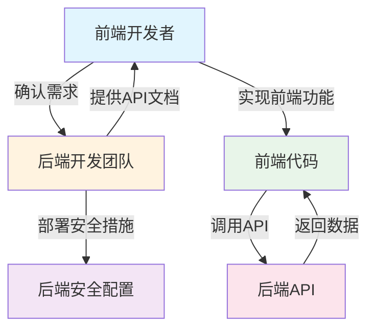

# 项目安全与优化文档 - 架构说明与职责划分

**项目架构**: 前后端分离模式  
**当前文档范围**: 前端部分（Vue 3 + Vite + Element Plus + Pinia + Axios）  
**后端协作**: 需要与后端API配合实现完整安全方案

---

## 前端职责范围（前端开发者可控）

| 安全领域 | 前端可完成的措施 | 依赖后端 |
|---------|-----------------|---------|
| 敏感信息管理 | ✅ 使用环境变量替代硬编码 | ❌ 不依赖 |
| XSS防护 | ✅ 输入验证、输出编码、DOMPurify净化 | ❌ 不依赖 |
| 密码强度验证 | ✅ 前端密码强度检查 | ❌ 不依赖 |
| HTTPS使用 | ✅ 强制使用HTTPS地址 | ❌ 不依赖 |
| 请求拦截 | ✅ Axios请求/响应拦截器 | 部分依赖 |
| CSRF防护 | ✅ 自动附加token到请求头 | ✅ 需要后端提供token接口 |
| 加密传输 | ✅ 客户端加密（如需要） | ✅ 需要后端配合解密 |

---

## 后端职责范围（需要与后端团队协调）

| 安全领域 | 后端必须实现 | 前端需要确认 |
|---------|-------------|-------------|
| HTTPS | 部署SSL证书，强制HTTPS跳转 | ✅ 确认已部署 |
| 密码哈希 | 使用bcrypt/argon2等安全哈希算法 | ✅ 确认算法 |
| CSRF保护 | 生成/验证token，设置安全Cookie | ✅ 确认接口 |
| 敏感信息存储 | 密钥安全存储，不返回敏感数据 | ✅ 确认存储方式 |
| API安全 | 频率限制、参数验证、注入防护 | ✅ 确认实现 |
| 会话管理 | 安全Session/Cookie配置 | ✅ 确认配置 |

---

## 安全修复优先级（前后端分离模式）

### 第一优先级：前端可独立完成 ✅

1. **敏感信息管理** - 使用环境变量，不依赖后端
2. **XSS防护** - 前端净化，不依赖后端
3. **密码强度验证** - 前端校验，不依赖后端

### 第二优先级：需要后端简单配合 ✅

4. **HTTPS使用** - 后端部署SSL，前端只需使用HTTPS地址

### 第三优先级：需要后端深度配合 ⚠️

5. **CSRF防护** - 需要后端提供token生成/验证接口
6. **加密传输** - 需要后端配合加解密逻辑

---

## 前后端协作流程

---

## 本文档使用说明

- ✅ **前端可执行**: 标注"前端实现"的代码可直接在当前项目中实施
- ⚠️ **需要协调后端**: 标注"需要后端配合"的内容需要与后端团队沟通
- ❌ **后端实现**: 标注"后端职责"的内容由后端团队负责，前端仅需确认

---

## 相关文档

- [README汇总](../README.md) - 所有优化文档索引
- [01. 敏感信息管理](./01-sensitive-info.md) - 硬编码问题修复
- [02. XSS防护](./02-xss-protection.md) - 跨站脚本攻击防护
- [03. 密码传输安全](./03-password-security.md) - 密码加密传输
- [04. CSRF防护](./04-csrf-protection.md) - 跨站请求伪造防护
- [05. 内存泄漏修复](./05-memory-leak.md) - 内存管理优化
- [06. Token过期处理](./06-token-expiry.md) - 会话管理完善
- [07. 错误处理改进](./07-error-handling.md) - 统一错误处理
- [08. 调试代码清理](./08-debug-code.md) - 生产环境优化
- [09. 安全存储方案](./09-secure-storage.md) - 加密存储实现
- [10. 性能优化](./10-performance.md) - 性能提升方案
- [11. 代码重构](./11-code-duplication.md) - 消除重复代码
- [12. 输入验证加强](./12-input-validation.md) - 数据校验完善
- [13. 响应式设计优化](./13-responsive-design.md) - 布局适配改进
- [修复优先级](./priority.md) - 实施计划建议
- [修复检查清单](./checklist.md) - 验收标准

---

**文档版本**: 1.0  
**创建日期**: 2026-01-07  
**最后更新**: 2026-01-07
